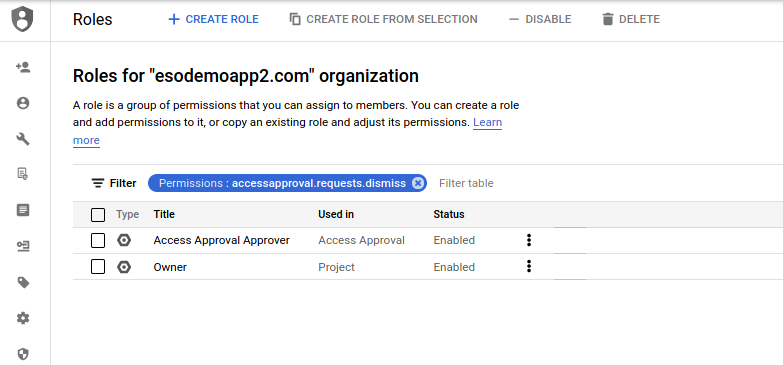
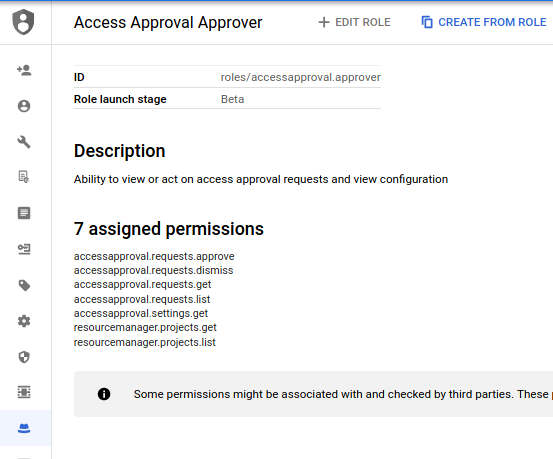
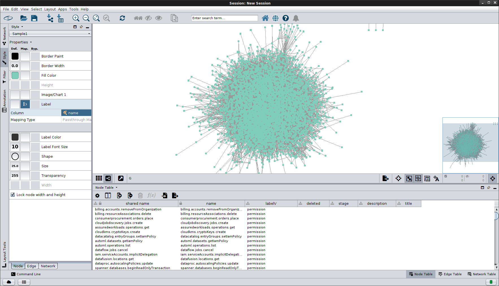
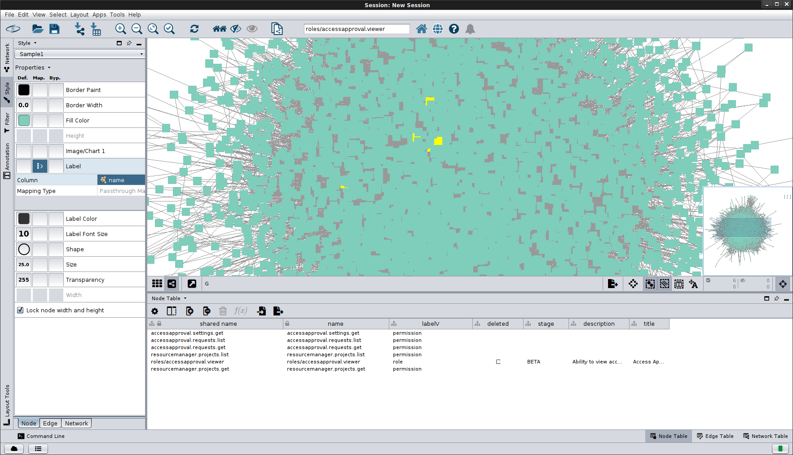

## Roles/Permission Maps

Simple application to enumerate all Google Cloud `Permissions->Roles` and `Roles->Permissions` to JSON.

To use this, you must have `Organization Role Viewer` and `Organization Viewer`  roles assigned to the current user or service account at the organization level.

First find the organization ID number:

```bash
$ gcloud organizations list
DISPLAY_NAME               ID  DIRECTORY_CUSTOMER_ID
esodemoapp2.com  673208786088              C023zw388
```

Then just specify that:

```bash
go run main.go -v 20 -alsologtostderr --organization 673208786088
```

The output will be a series of JSON files that list out the custom roles for at the project and organization level.

the files `roles_default.json` and `permissions_default.json` include all the roles/permissions in the organization.


```json
$ cat roles_default.json | jq '.roles[]  | select(.name=="projects/fabled-ray-104117/roles/SSHOSLoginRole")'
{
  "name": "projects/fabled-ray-104117/roles/SSHOSLoginRole",
  "role": {
    "description": "Role to grant SSH OS Login",
    "etag": "BwW6RP6hDqA=",
    "name": "projects/fabled-ray-104117/roles/SSHOSLoginRole",
    "title": "sshOSLoginRole"
  },
  "included_permissions": [
    "compute.instances.osLogin",
    "compute.instances.setMetadata",
    "compute.instances.use"
  ]
}
```

```json
$ cat permissions*.json | jq '.permissions[]  | select(.name=="compute.instances.use")'
{
  "name": "compute.instances.use",
  "roles": [
    "projects/fabled-ray-104117/roles/SSHRole",
    "projects/fabled-ray-104117/roles/SSHOSLoginRole",
    "roles/compute.instanceAdmin.v1",
    "roles/dataproc.serviceAgent",
    "roles/cloudtpu.serviceAgent",
    "roles/compute.loadBalancerAdmin",
    "roles/compute.networkAdmin",
    "roles/composer.serviceAgent",
    "roles/compute.admin",
    "roles/compute.instanceAdmin",
    "roles/container.serviceAgent",
    "roles/appengineflex.serviceAgent",
    "roles/dataflow.serviceAgent",
    "roles/cloudmigration.inframanager",
    "roles/editor",
    "roles/genomics.serviceAgent",
    "roles/lifesciences.serviceAgent",
    "roles/notebooks.legacyAdmin",
    "roles/notebooks.serviceAgent",
    "roles/owner",
    "roles/vpcaccess.serviceAgent"
  ]
}
{
  "name": "compute.instances.use",
  "roles": [
    "projects/fabled-ray-104117/roles/SSHRole",
    "projects/fabled-ray-104117/roles/SSHOSLoginRole"
  ]
}
```

This API uses `google.golang.org/api/iam/v1` API which at currently does not enumerate Permissions but lists those permissions associated with a Role.
That is, if a Role has permissions [a,b,c], they will be listed in the output.  If a permission is _not_ associated with any role for any reason, it will not be included in the map.

Note, the [PermissionService](https://pkg.go.dev/google.golang.org/api/iam/v1#PermissionsService) does not have an API to list all permissions by itself.

### BigQuery Exports 

This script is equivalent to running an export of [GCP Policy Export to ](https://cloud.google.com/asset-inventory/docs/analyzing-iam-policy-longrunning-bigquery)
and then unnesting the included permissions.

```sql
SELECT p, r.name
 FROM `gcpdentity-asset-export-1.asset_inventory.iam_googleapis_com_Role` r, 
       UNNEST(r.resource.data.includedPermissions) p    
 WHERE DATE(timestamp) = "2021-02-12" 
```

### Cloud Console

You can use the cloud console to map the roles-permissions:






### Using Asset Inventory to iterate Projects/Organization

If you want to iterate projects using asset-inventory API, assign the user `Cloud Asset Viewer` role at org level and the `serviceusage.services.use` _permission_ on the project that is configured with `gcloud config list`.  Once that is done, specify `--useAssetInventoryAPI`

### GraphML

If you want to display the `Roles` <-> `Permissions` as a graph, run the map application with `--generateGraphDB` option and redirect the output as such (remember to reduce the log level to 0)

eg
```bash
go run main.go -v 0 -alsologtostderr --organization 673208786098 --generateGraphDB > /tmp/graph.groovy
```

The output file will contain raw groovy command set which you can import into JanusGraph

If you just want to see the default graph/map for roles-permissions (not including custom roles, just load the static file into [Cytoscape](https://cytoscape.org/))

The `--mode` switch in the command line will either 
- (default) iterate of the standard roles/permissions
- `--mode=project`: iterate of project-level roles/permissions
- `--mode=organization`: iterate over organization-level roles/permissions

#### Install JanusGraph

- Local
Download and untar [JanusGraph](http://janusgraph.org/).  I used version [janusgraph-0.3.0-hadoop2](https://github.com/JanusGraph/janusgraph/releases/tag/v0.3.0)

* Start JanusGraph with defaults (Cassandra, ElasticSearch local)  
  Note, you need [java8](https://docs.janusgraph.org/getting-started/installation/#local-installation)

```bash
export JAVA_HOME=/path/to/jre1.8.0_211/

$ janusgraph-0.3.0-hadoop2/bin/janusgraph.sh start
Forking Cassandra...
Running `nodetool statusthrift`.. OK (returned exit status 0 and printed string "running").
Forking Elasticsearch...
Connecting to Elasticsearch (127.0.0.1:9200)..... OK (connected to 127.0.0.1:9200).
Forking Gremlin-Server...
Connecting to Gremlin-Server (127.0.0.1:8182)..... OK (connected to 127.0.0.1:8182).
Run gremlin.sh to connect.
```

* Connect via Gremlin

- [gremlin-server](http://tinkerpop.apache.org/docs/current/reference/#gremlin-server)

```bash
$ janusgraph-0.3.0-hadoop2/bin/gremlin.sh

         \,,,/
         (o o)
-----oOOo-(3)-oOOo-----
SLF4J: Class path contains multiple SLF4J bindings.
plugin activated: janusgraph.imports
plugin activated: tinkerpop.server
plugin activated: tinkerpop.gephi
plugin activated: tinkerpop.utilities
gremlin>
```

- Setup Gremlin local connection

```
:remote connect tinkerpop.server conf/remote.yaml session
:remote console
```

Run Exporter

```bash
go run main.go -v 0 -alsologtostderr --organization 673208786098 --generateGraphDB > /tmp/graph.groovy
```

Load output file

```groovy
g.V().drop()
g.E().drop()

:load  /tmp/graph.groovy
```
>> the load may take ~hr, right

TODO: make it parallel, the groovy file creates all the permission vertices first...the role permission map could be done in a parallel...

Once loaded into JanusGraph, use tinkerpop to query the graph or render it with an external tool like CytoScape

- Outbound Edges from a Vertex:

  Which Roles include this permission:
```groovy
gremlin> g.V().hasLabel('permission').has('name', 'accessapproval.requests.list').outE()
==>e[1ozr6-102z4-6c5-1z0zk][1683472-in->3313856]
==>e[1abk2-102z4-6c5-1z7a8][1683472-in->3322016]
==>e[1g3cy-102z4-6c5-1zwkg][1683472-in->3354784]
==>e[u58i-102z4-6c5-202rs][1683472-in->3362824]
==>e[uarm-102z4-6c5-21noo][1683472-in->3436584]
==>e[1pwxu-102z4-6c5-235fc][1683472-in->3506232]
==>e[1vchu-102z4-6c5-24ahc][1683472-in->3559440]
```

```groovy
gremlin> g.V().hasLabel('permission').has('name', 'accessapproval.requests.list').out().valueMap()
==>{deleted=[false], stage=[GA], name=[roles/iam.securityAdmin], description=[Security admin role, with permissions to get and set any IAM policy.], title=[Security Admin]}
==>{deleted=[false], stage=[GA], name=[roles/editor], description=[Edit access to all resources.], title=[Editor]}
==>{deleted=[false], stage=[GA], name=[roles/owner], description=[Full access to all resources.], title=[Owner]}
==>{deleted=[false], stage=[BETA], name=[roles/accessapproval.viewer], description=[Ability to view access approval requests and configuration], title=[Access Approval Viewer]}
==>{deleted=[false], stage=[BETA], name=[roles/accessapproval.approver], description=[Ability to view or act on access approval requests and view configuration], title=[Access Approval Approver]}
==>{deleted=[false], stage=[GA], name=[roles/iam.securityReviewer], description=[Security reviewer role, with permissions to get any IAM policy.], title=[Security Reviewer]}
==>{deleted=[false], stage=[GA], name=[roles/viewer], description=[Read access to all resources.], title=[Viewer]}
```


- Connected Vertices:

Which permission are included in a ROle

```groovy
gremlin> i=g.V().outE().hasLabel('in').inV().has('name','roles/accessapproval.viewer')[0].id()

gremlin> g.V().hasLabel('permission').where(out().hasId(i)).valueMap()
==>{name=[resourcemanager.projects.list]}
==>{name=[resourcemanager.projects.get]}
==>{name=[accessapproval.requests.get]}
==>{name=[accessapproval.requests.list]}
==>{name=[accessapproval.settings.get]}
```
#### Load Graph to CytoScape


For [Cytoscape](https://cytoscape.org/), export graph to GraphML file:

```
gremlin> sg = g.V().outE().subgraph('sg').cap('sg').next()
==>tinkergraph[vertices:4703 edges:34216]

gremlin> sg.io(IoCore.graphml()).writeGraph("/tmp/mygraph.xml")
==>null
```

- Import GraphML to Cytoscape

As file:

```
gsutil cp gs://iam-graph/graph_03102020.xml .
```

on Cytoscape, ```File->Import->Network->File```,  Select ```GraphMLFile```  the ```/tmp/mygraph.xml```


As URL

on Cytoscape, ```File->Import->Network->URL```,  Use URL
- [https://storage.googleapis.com/iam-graph/graph_03102020.xml](https://storage.googleapis.com/iam-graph/graph_03102020.xml)


Upon import you should see the Cytoscape rendering:




then ofcourse if you want to graph waldo and his neighbors



yeah, thats the limit of how much useful stuff i know with cytoscape