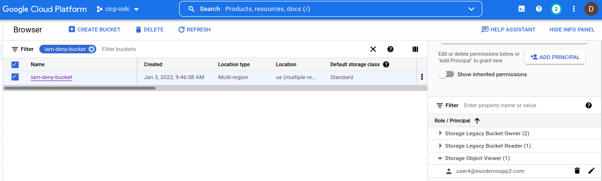
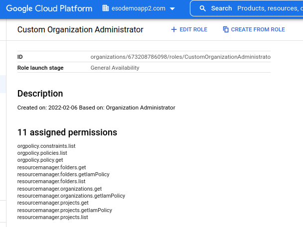
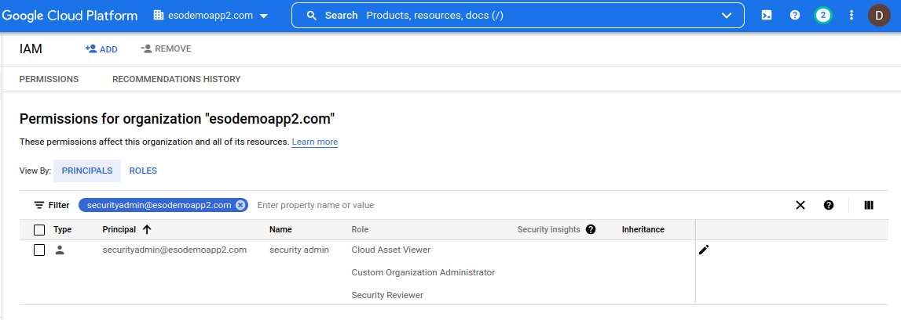

## IAM Permission Verification

Google Cloud IAM Troubleshooting scripts intended to provide several indicators of users permissions on GCP resources.

* `inspect/query` 
  - [checkEndUserPermissions](#checkEndUserPermissions)

    - Allows an end user to ask "of all the permissions this resource accepts, which ones do I have?"
    - Allows a domain administrator to _impersonate_ any user and inspect which permissions that user has on a resource.
     
  - [usePolicyTroubleshooter](#usePolicyTroubleshooter)

     - Use [IAM Policy Troubleshooter](https://cloud.google.com/iam/docs/troubleshooting-access) API to determine if the user has IAM access to a resource. 
     
     - Display if [IAM Conditions](https://cloud.google.com/iam/docs/conditions-overview) are applicable.

     - Backtrack the [IAM Resource Hierarchy](https://cloud.google.com/iam/docs/resource-hierarchy-access-control) from the resource to root and display all the IAM Roles present at each node. (`TODO`: display subset of permissions at each node applicable to the target resource)

  - [useIAMPolicyRequest](#useIAMPolicyRequest)

    - Use [IAM Policy Analyzer](https://cloud.google.com/asset-inventory/docs/analyzing-iam-policy) to help determine if a given user has access to a resource through indirect capabilities:

      - Through nested or direct group memberships bound to the resource
      - Through [service account impersonation](https://cloud.google.com/iam/docs/creating-short-lived-service-account-credentials) where the service account has direct or indirect access.
      - Other mechanisms described [here](https://cloud.google.com/asset-inventory/docs/analyzing-iam-policy#overview)


## Setup

The following utilities require various levels of privleged access to run and are described in the corresponding section

Some scripts redirect the quota to a given project for consumption and is described in the appropriate setup scripts below.  For more information see [serviceUsageConsumer](#serviceusageconsumer) 

Many of these scripts makes use of GCP Resource Names.  For reference, see:

* [Cloud Full resource names](https://cloud.google.com/iam/docs/full-resource-names)
* [Cloud Asset Inventory Types](https://cloud.google.com/asset-inventory/docs/supported-asset-types#analyzable_asset_types)


## Inspect/Query

#### checkEndUserPermissions

This script can be used in two modes:

* As a user: "_What permissions do I have on this resource?_"
* As an administrator: "_what permissions does this user have on the resource?_"


For the first mode, no additional permissions are required since its a type of "self-check"

For the second, this necessarily requires the ability for the administrator to perform [Domain Wide Delegation](https://developers.google.com/admin-sdk/directory/v1/guides/delegation).  This level of access basically allows you to impersonate any user and then see what permissions they have _as that user_.  As far as GCP is concerned, the request for IAM permissions check comes as if it is from the end user.   

Notably, this level of access is rare but is left here as an option. 

Configuring the second mode requires a user to have domain-wide/administrator privileges and a service account enabled on the domain for Cloud Platform IAM Scope.  See [Configure Domain Wide Delegation](#configure-domain-wide-delegation) 


- **Usage - As current user**

Assume the user currently configured for [Application Default Credentials](https://cloud.google.com/docs/authentication/production) is the End User (`user4@esodemoapp2.com`) and wants to "see" what permissions he/she has on GCS Bucket `//storage.googleapis.com/projects/_/buckets/iam-deny-bucket`

Running the following script as that user show 

1. All the potential permissions this resource accepts
2. All the permissions this user currently has.

Note that the second set is initially empty since this user does *NOT* have any access

```log
$   go run main.go  \
     --checkResource="//storage.googleapis.com/projects/_/buckets/iam-deny-bucket"  \
     --printPermissionsOnResource \
     -v 20 -alsologtostderr

I0207 11:37:28.549307  456856 main.go:104] ================ QueryTestablePermissions with Resource ======================
I0207 11:37:28.723178  456856 main.go:127] ================ Getting Permissions 
I0207 11:37:28.723209  456856 main.go:141] Testable permissions on resource:
I0207 11:37:28.723217  456856 main.go:143]      resourcemanager.hierarchyNodes.createTagBinding
I0207 11:37:28.723224  456856 main.go:143]      resourcemanager.hierarchyNodes.deleteTagBinding
I0207 11:37:28.723231  456856 main.go:143]      resourcemanager.hierarchyNodes.listTagBindings
I0207 11:37:28.723237  456856 main.go:143]      resourcemanager.resourceTagBindings.create
I0207 11:37:28.723251  456856 main.go:143]      resourcemanager.resourceTagBindings.delete
I0207 11:37:28.723260  456856 main.go:143]      resourcemanager.resourceTagBindings.list
I0207 11:37:28.723266  456856 main.go:143]      storage.buckets.createTagBinding
I0207 11:37:28.723275  456856 main.go:143]      storage.buckets.delete
I0207 11:37:28.723282  456856 main.go:143]      storage.buckets.deleteTagBinding
I0207 11:37:28.723289  456856 main.go:143]      storage.buckets.get
I0207 11:37:28.723299  456856 main.go:143]      storage.buckets.getIamPolicy
I0207 11:37:28.723306  456856 main.go:143]      storage.buckets.listTagBindings
I0207 11:37:28.723315  456856 main.go:143]      storage.buckets.setIamPolicy
I0207 11:37:28.723323  456856 main.go:143]      storage.buckets.update
I0207 11:37:28.723331  456856 main.go:143]      storage.multipartUploads.abort
I0207 11:37:28.723337  456856 main.go:143]      storage.multipartUploads.create
I0207 11:37:28.723352  456856 main.go:143]      storage.multipartUploads.list
I0207 11:37:28.723361  456856 main.go:143]      storage.multipartUploads.listParts
I0207 11:37:28.723369  456856 main.go:143]      storage.objects.create
I0207 11:37:28.723377  456856 main.go:143]      storage.objects.delete
I0207 11:37:28.723385  456856 main.go:143]      storage.objects.get
I0207 11:37:28.723393  456856 main.go:143]      storage.objects.getIamPolicy
I0207 11:37:28.723401  456856 main.go:143]      storage.objects.list
I0207 11:37:28.723408  456856 main.go:143]      storage.objects.setIamPolicy
I0207 11:37:28.723416  456856 main.go:143]      storage.objects.update
I0207 11:37:28.723613  456856 main.go:1204] ==== TestIAMPermissions as GCS Bucket Resource ====
I0207 11:37:28.837305  456856 main.go:1238]  User permission  on resource: 
```

Now add in an IAM the `storageViewer` role



and run the script again

```log
$   go run main.go  \
     --checkResource="//storage.googleapis.com/projects/_/buckets/iam-deny-bucket"  \
     --printPermissionsOnResource \
     -v 20 -alsologtostderr


I0207 11:44:19.616210  457832 main.go:1204] ==== TestIAMPermissions as GCS Bucket Resource ====
I0207 11:44:19.970744  457832 main.go:1238]  User permission  on resource: 
I0207 11:44:19.970790  457832 main.go:1240]      storage.objects.get
I0207 11:44:19.970818  457832 main.go:1240]      storage.objects.list
```

Note that now the user has *TWO* additional permissions show up. These are the permissions this user has from the field of potential permissions even applicable to this resource type.

- **Usage - As Administrator**

You can run this script as an administrator but to do this requires extensive the administrator to _impersonate an end user_ through domain delegation.


For example, if an admistrator `securityadmin@esodemoapp2.com` has access to impersonate a service account `adminapi@fabled-ray-104117.iam.gserviceaccount.com` which itself has domain-delegation permissions, the the `securityadmin` can "see" the resource as the user:


```bash
gcloud config set account securityadmin@esodemoapp2.com
gcloud auth application-default login


## impersonate user:user4@esodemoapp2.com and check which permissions apply to resource as that user
go run main.go  \
   --checkResource="//storage.googleapis.com/projects/_/buckets/iam-deny-bucket"   \
   --identity=user:user4@esodemoapp2.com \
   --checkEndUserPermissions     --printPermissionsOnResource  \
   --impersonateServiceAccount=adminapi@fabled-ray-104117.iam.gserviceaccount.com  \
   -v 20 -alsologtostderr

I0207 12:09:10.051084  461691 main.go:1204] ==== TestIAMPermissions as GCS Bucket Resource ====
I0207 12:09:10.298606  461691 main.go:1238]  User permission  on resource: 
I0207 12:09:10.298649  461691 main.go:1240]      storage.objects.get
I0207 12:09:10.298708  461691 main.go:1240]      storage.objects.list
```

The other resource types supported:

```golang
const bigqueryTablesRegex untyped string = "//bigquery.googleapis.com/projects/(.+)/datasets/(.+)/tables/(.+)"
const iamServiceAccountsRegex untyped string = "//iam.googleapis.com/projects/(.+)/serviceAccounts/(.+)"
const serviceAccountsKeysRegex untyped string = "//iam.googleapis.com/projects/(.+)/serviceAccounts/(.+)/keys/(.+)"
const iapAppEngineRegex untyped string = "//iap.googleapis.com/projects/(.+)/iap_web/appengine-(.+)/services/(.+)"
const iapGCERegex untyped string = "//iap.googleapis.com/projects/(.+)/iap_web/compute/services/(.+)"
const spannerInstances untyped string = "//spanner.googleapis.com/projects/(.+)/instances/(.+)"
const storageBucketsRegex untyped string = "//storage.googleapis.com/projects/_/buckets/(.+)"
const computeInstanceRegex untyped string = "//compute.googleapis.com/projects/(.+)/zones/(.+)/instances/(.+)$"
const computeSubNetworksRegex untyped string = "//compute.googleapis.com/projects/(.+)/regions/(.+)/subnetworks/(.+)"
const resourceManagerOrganizationRegex untyped string = "//cloudresourcemanager.googleapis.com/organizations/(.+)"
const resourceManagerProjectsRegex untyped string = "//cloudresourcemanager.googleapis.com/projects/(.+)"
```

##### checkEndUserPermissions Caveats

   * Script will show if the user has direct or group-membership based access on the resource
   * Script _will not_ show 
     - if the user has conditional access
     - has access through service account impersonation
     - has access through workload identity federation

---

#### usePolicyTroubleshooter

Subscript that uses the IAM Policy Troubleshooter API to show if the user has access to a resource or not and how it got that access.

Once the user's apparent access is displayed, this script will attempt to print all the IAM roles in the resource hierarchy back to the org node.

The reason to do this is to display the roles and (eventually; its still a TODO:), extract out all the IAM permissions contained in those roles and filter/display only those permissions that apply to this resource (as provided by the `checkEndUserPermissions` subscript.)

Anyway, this requires the user who is running this script to have (preferably), have the following organizational level permissions: 

`Cloud Asset Viewer`, `Security Reviewer` and the subset of these `ready-only` permission at the org level:

```bash
    orgpolicy.constraints.list
    orgpolicy.policies.list
    orgpolicy.policy.get
    resourcemanager.folders.get
    resourcemanager.folders.getIamPolicy
    resourcemanager.folders.list
    resourcemanager.organizations.get
    resourcemanager.organizations.getIamPolicy
    resourcemanager.projects.get
    resourcemanager.projects.getIamPolicy
    resourcemanager.projects.list
    #iam.denypolicies.get
    #iam.denypolicies.list
```

Note, the default role `Organization Administrator` has the `set IAMPolicy` permissions.  The recommendation is to create a custom role with just the permissions set above:







- Usage

To use this script, specify the appropriate resource name and permission to check.

for reference on the format for the `checkResource` and `permissions`, see 

* [Permissions Reference](https://cloud.google.com/iam/docs/permissions-reference)
* [Resource Names](https://cloud.google.com/apis/design/resource_names)


For example, if you want to check if an end-user `user4@esodemoapp2.com` has the `storage.objects.get` permission on a GCS Bucket `iam-deny-bucket` and you know that the bucket is in project `projects/cicp-oidc`, then issue the command switches:

```log
$  go run main.go  \
     --checkResource="//storage.googleapis.com/projects/_/buckets/iam-deny-bucket" \
     --permissionToCheck=storage.objects.get \
     --identity="user:user4@esodemoapp2.com" \
     --scope="projects/cicp-oidc" \
     --usePolicyTroubleshooter \
     --projectID=fabled-ray-104117 \
     -v 10 -alsologtostderr


I0207 12:20:16.054049  464112 main.go:369] Getting PolicyTroubleshooter
I0207 12:20:17.082121  464112 main.go:403]    User's AccessState GRANTED
I0207 12:20:17.082234  464112 main.go:407]    User's AccessState granted at //storage.googleapis.com/projects/_/buckets/iam-deny-bucket
I0207 12:20:17.082283  464112 main.go:413]    user has binding with permission via roles roles/storage.objectViewer
I0207 12:20:17.082327  464112 main.go:414]    through membership map[user:user4@esodemoapp2.com:membership:MEMBERSHIP_INCLUDED  relevance:HIGH]


I0207 12:20:17.082420  464112 main.go:424] ================ Determining Hierarchy for resource //storage.googleapis.com/projects/_/buckets/iam-deny-bucket
I0207 12:20:17.082437  464112 main.go:438] Getting ScopedPermission for resource [//storage.googleapis.com/projects/_/buckets/iam-deny-bucket] in scope [projects/cicp-oidc]
I0207 12:20:17.082697  464112 main.go:570] ==== Scoped Resource is GCS Bucket ==== iam-deny-bucket
I0207 12:20:17.572652  464112 main.go:593]        Roles ==== roles/storage.legacyBucketOwner
I0207 12:20:17.572795  464112 main.go:593]        Roles ==== roles/storage.legacyBucketReader
I0207 12:20:17.572873  464112 main.go:593]        Roles ==== roles/storage.objectViewer
I0207 12:20:17.573197  464112 main.go:817]        SearchingAssets of type [storage.googleapis.com/Bucket] with query [name:iam-deny-bucket] 
I0207 12:20:18.111847  464112 main.go:875]        Ancestor: [project/cicp-oidc]
I0207 12:20:18.111958  464112 main.go:879]        Project: [cicp-oidc]
I0207 12:20:18.352594  464112 main.go:890]                 Policy Binding roles/cloudasset.viewer
I0207 12:20:18.352723  464112 main.go:890]                 Policy Binding roles/cloudfunctions.serviceAgent
I0207 12:20:18.352809  464112 main.go:890]                 Policy Binding roles/compute.serviceAgent
I0207 12:20:18.352892  464112 main.go:890]                 Policy Binding roles/editor
I0207 12:20:18.352972  464112 main.go:890]                 Policy Binding roles/firebase.managementServiceAgent
I0207 12:20:18.353055  464112 main.go:890]                 Policy Binding roles/firebase.sdkAdminServiceAgent
I0207 12:20:18.353135  464112 main.go:890]                 Policy Binding roles/firebaserules.system
I0207 12:20:18.353215  464112 main.go:890]                 Policy Binding roles/firestore.serviceAgent
I0207 12:20:18.353296  464112 main.go:890]                 Policy Binding roles/iam.securityAdmin
I0207 12:20:18.353377  464112 main.go:890]                 Policy Binding roles/iam.serviceAccountTokenCreator
I0207 12:20:18.353457  464112 main.go:890]                 Policy Binding roles/owner
I0207 12:20:18.353538  464112 main.go:890]                 Policy Binding roles/storage.objectViewer
I0207 12:20:18.353613  464112 main.go:875]        Ancestor: [folder/750467892309]
I0207 12:20:18.353690  464112 main.go:895]        Folder: [750467892309]
I0207 12:20:18.659502  464112 main.go:905]                 Policy Binding roles/resourcemanager.folderAdmin
I0207 12:20:18.659634  464112 main.go:905]                 Policy Binding roles/resourcemanager.folderEditor
I0207 12:20:18.659713  464112 main.go:875]        Ancestor: [organization/673208786098]
I0207 12:20:18.659790  464112 main.go:911]        Organization: [673208786098]
I0207 12:20:18.880545  464112 main.go:921]                 Policy Binding organizations/673208786098/roles/CustomOrganizationAdministrato
I0207 12:20:18.880680  464112 main.go:921]                 Policy Binding roles/accesscontextmanager.gcpAccessAdmin
I0207 12:20:18.880771  464112 main.go:921]                 Policy Binding roles/accesscontextmanager.policyAdmin
I0207 12:20:18.880852  464112 main.go:921]                 Policy Binding roles/accesscontextmanager.policyEditor
I0207 12:20:18.880933  464112 main.go:921]                 Policy Binding roles/bigquery.jobUser
I0207 12:20:18.881036  464112 main.go:921]                 Policy Binding roles/billing.admin
I0207 12:20:18.881117  464112 main.go:921]                 Policy Binding roles/cloudasset.viewer
I0207 12:20:18.881198  464112 main.go:921]                 Policy Binding roles/cloudfunctions.serviceAgent
I0207 12:20:18.881284  464112 main.go:921]                 Policy Binding roles/iam.denyAdmin
I0207 12:20:18.881365  464112 main.go:921]                 Policy Binding roles/iam.organizationRoleViewer
I0207 12:20:18.881444  464112 main.go:921]                 Policy Binding roles/iam.securityReviewer
I0207 12:20:18.881523  464112 main.go:921]                 Policy Binding roles/monitoring.viewer
I0207 12:20:18.881603  464112 main.go:921]                 Policy Binding roles/orgpolicy.policyAdmin
I0207 12:20:18.881681  464112 main.go:921]                 Policy Binding roles/orgpolicy.policyViewer
I0207 12:20:18.881761  464112 main.go:921]                 Policy Binding roles/owner
I0207 12:20:18.881840  464112 main.go:921]                 Policy Binding roles/resourcemanager.folderAdmin
I0207 12:20:18.881919  464112 main.go:921]                 Policy Binding roles/resourcemanager.folderCreator
I0207 12:20:18.882000  464112 main.go:921]                 Policy Binding roles/resourcemanager.folderEditor
I0207 12:20:18.882079  464112 main.go:921]                 Policy Binding roles/resourcemanager.folderMover
I0207 12:20:18.882172  464112 main.go:921]                 Policy Binding roles/resourcemanager.folderViewer
I0207 12:20:18.882242  464112 main.go:921]                 Policy Binding roles/resourcemanager.organizationAdmin
I0207 12:20:18.882310  464112 main.go:921]                 Policy Binding roles/resourcemanager.organizationViewer
I0207 12:20:18.882383  464112 main.go:921]                 Policy Binding roles/resourcemanager.projectCreator
I0207 12:20:18.882452  464112 main.go:921]                 Policy Binding roles/resourcemanager.projectIamAdmin
I0207 12:20:18.882520  464112 main.go:921]                 Policy Binding roles/securitycenter.serviceAgent
I0207 12:20:18.882590  464112 main.go:921]                 Policy Binding roles/serviceusage.serviceUsageAdmin
I0207 12:20:18.882659  464112 main.go:921]                 Policy Binding roles/serviceusage.serviceUsageConsumer
```

The output here shows that 

* User has access to this resource

```log
I0207 12:20:17.082121  464112 main.go:403]    User's AccessState GRANTED
I0207 12:20:17.082234  464112 main.go:407]    User's AccessState granted at //storage.googleapis.com/projects/_/buckets/iam-deny-bucket
I0207 12:20:17.082283  464112 main.go:413]    user has binding with permission via roles roles/storage.objectViewer
I0207 12:20:17.082327  464112 main.go:414]    through membership map[user:user4@esodemoapp2.com:membership:MEMBERSHIP_INCLUDED  relevance:HIGH]
```

while the rest of the script "walks back" the IAM tree to the root and displays the IAM role bindingsat each node.  Again, a TODO for me is to print the subset of permissions applicable and any conditions that may exist in those role bindings

There are a few other resource types supported for this utility:


- `Organization`

```bash
--checkResource="//cloudresourcemanager.googleapis.com/organizations/673208786098"
--permissionToCheck=storage.objects.get
```

- `Folder`

```bash
--checkResource="//cloudresourcemanager.googleapis.com/folders/750467892309"
--permissionToCheck=storage.objects.get  --identity="user:user4@esodemoapp2.com"
```

- `Project`

```bash
--checkResource="//cloudresourcemanager.googleapis.com/projects/fabled-ray-104117"    
--permissionToCheck=iam.roles.list
```

- `BigQuery`

```bash
## Table
  --checkResource="//bigquery.googleapis.com/projects/fabled-ray-104117/datasets/test/tables/person"   
  --permissionToCheck=bigquery.tables.get 


## Dataset
--checkResource="//bigquery.googleapis.com/projects/fabled-ray-104117/datasets/test"  
--permissionToCheck=bigquery.datasets.get
```

  TODO: not working   "message": "Internal error encountered."

- `ServiceAccount`

```bash
  --checkResource="//iam.googleapis.com/projects/fabled-ray-104117/serviceAccounts/schedulerunner@fabled-ray-104117.iam.gserviceaccount.com"   --permissionToCheck=iam.serviceAccounts.get
```

- `IAP`

```bash
## AppEngine
  --checkResource="//iap.googleapis.com/projects/248066739582/iap_web/appengine-fabled-ray-104117/services/default"    
  --permissionToCheck=iap.webServiceVersions.accessViaIAP

## GCE Backend Service
  --checkResource="//iap.googleapis.com/projects/248066739582/iap_web/compute/services/ngin-bs"   
  --permissionToCheck=iap.webServiceVersions.accessViaIAP 
```

- `GCE Instance`

```bash
--checkResource="//compute.googleapis.com/projects/fabled-ray-104117/zones/us-central1-a/instances/instance-1"
--permissionToCheck=compute.instances.get    --identity="user:user4@esodemoapp2.com"
```

---

#### useIAMPolicyRequest

Script the IAM Policy API to fully explore the direct and indirect permissions that a given user has on a resource.

The way this script works is by issuing an IAM Analysis query with all the flags set to try an get a complete picture.

API call looks like this:

```golang
			req := &assetpb.AnalyzeIamPolicyLongrunningRequest{
				AnalysisQuery: &assetpb.IamPolicyAnalysisQuery{
					Scope: *scope,
					ResourceSelector: &assetpb.IamPolicyAnalysisQuery_ResourceSelector{
						FullResourceName: *checkResource,
					},
					IdentitySelector: &assetpb.IamPolicyAnalysisQuery_IdentitySelector{
						Identity: *identity,
					},
					Options: &assetpb.IamPolicyAnalysisQuery_Options{
						ExpandGroups:                       true,
						OutputGroupEdges:                   true,
						ExpandResources:                    true,
						ExpandRoles:                        true,
						OutputResourceEdges:                true,
						AnalyzeServiceAccountImpersonation: *enableImpersonatedCheck,
					},
				},
				OutputConfig: &assetpb.IamPolicyAnalysisOutputConfig{
					Destination: &assetpb.IamPolicyAnalysisOutputConfig_GcsDestination_{
						GcsDestination: &assetpb.IamPolicyAnalysisOutputConfig_GcsDestination{
							Uri: fmt.Sprintf("%s/%s", *gcsDestinationForLongRunningAnalysis, fileName),
						},
					},
				},
			}
```

Note the `OutputConfig` is a bit odd:  it writes the output of the analysis to a GCS bucket.  At the moment, this API only supports writing the output to a gcs file or to BQ.   (Ideally, it should return the full set through a long-running operation result directly to the client).  As a workaround, this script mimics the LRO response output by asking the API to write to a GCS file and then reading that file to parse out the response (i know, crappy but its the only way currently).  

Since GCS access is now in the picture, it'll help explain the bucket creation and permission steps below.


As for permission required to run this query: `Cloud Asset Viewer`, `Security Reviewer` and the subset of these `ready-only` permission at the org level as described in the [usePolicyTroubleshooter](#usePolicyTroubleshooter) section is required

The user (`securityadmin@`) running the script must have [ServiceUsageConsumer](#ServiceUsageConsumer) on the project specified in the `--projectID` parameter

The user (`securityadmin@`) running the script must have read/write permission on a GCS 


In the following, the bucket and service usage permissions are on quotaProject `fabled-ray-104117`
```bash
## Create bucket
gsutil mb gs://fabled-ray-104117-lro

# add permissions 
gsutil iam ch user:securityadmin@esodemoapp2.com:objectAdmin  gs://fabled-ray-104117-lro

## init user running script
gcloud config set account securityadmin@esodemoapp2.com
gcloud auth application-default login
gcloud config set project fabled-ray-104117
```

##### Usage

The following attempts to see if the user `user4@esodemoapp2.com` has access to `//storage.googleapis.com/projects/_/buckets/iam-deny-bucket` and where the query is scoped (either project, folder or organization level)

>> note, if you omit `enableImpersonatedCheck`, the output will not be written to the the GCS bucket and will NOT include information about any potential service-account impersonation based access.

You must specify the `--scope=` variable which defines the search field (e.g Project: `--scope="projects/cicp-oidc"`, Folders: `--scope="folders/750467892309"`, Organization: `--scope="organizations/673208786098"`).

You can specify any supported [Full resource names](https://cloud.google.com/iam/docs/full-resource-names).

- User without access:

(using project scoped)

```log
$ go run main.go   \
    --checkResource="//storage.googleapis.com/projects/_/buckets/iam-deny-bucket" \
    --identity="user:user4@esodemoapp2.com" \
    --scope="projects/cicp-oidc" \
    --useIAMPolicyRequest \
    --projectID=fabled-ray-104117  \
    --enableImpersonatedCheck \
    --gcsDestinationForLongRunningAnalysis=gs://fabled-ray-104117-lro \
    -v 20 -alsologtostderr

I0207 13:37:44.212252  477325 main.go:202] Getting AnalyzeIamPolicyRequest
I0207 13:37:45.595553  477325 main.go:317]       Result written to gs://fabled-ray-104117-lro/20220207183744
``` 

##### User with direct access

* `user4` has an IAM binding directly on `iam-deny-bucket`

```log
go run main.go     --checkResource="//storage.googleapis.com/projects/_/buckets/iam-deny-bucket"  \
  --identity="user:user4@esodemoapp2.com"    --scope="projects/cicp-oidc" \
  --useIAMPolicyRequest \
  --projectID=fabled-ray-104117 \
  --enableImpersonatedCheck \
  --gcsDestinationForLongRunningAnalysis=gs://fabled-ray-104117-bucket \
  -v 20 -alsologtostderr


I0207 13:59:51.972794  481047 main.go:202] Getting AnalyzeIamPolicyRequest
I0207 13:59:53.659686  481047 main.go:316]       Result written to gs://fabled-ray-104117-lro/20220207185951
I0207 13:59:54.048486  481047 main.go:357]       Parsed AnalyzeIamPolicyResponse from gs://fabled-ray-104117-lro/20220207185951
I0207 13:59:54.048571  481047 main.go:362]       user:user4@esodemoapp2.com has access to resource [full_resource_name:"//storage.googleapis.com/iam-deny-bucket"]
I0207 13:59:54.048671  481047 main.go:363]         with capability [permission:"storage.objects.get" role:"roles/storage.objectViewer" permission:"storage.objects.list"]
I0207 13:59:54.048755  481047 main.go:364]         from node [//storage.googleapis.com/iam-deny-bucket]
I0207 13:59:54.048803  481047 main.go:372]           user is directly included in the role binding 
```

##### Indirect: Groups binding to Project

* `user4` is member of `group4_7@`
* `group4_7@` has direct access to `iam-deny-bucket` through binding at Project level

```log
go run main.go     --checkResource="//storage.googleapis.com/projects/_/buckets/iam-deny-bucket"  \
  --identity="user:user4@esodemoapp2.com"    --scope="projects/cicp-oidc" \
  --useIAMPolicyRequest \
  --projectID=fabled-ray-104117 \
  --enableImpersonatedCheck \
  --gcsDestinationForLongRunningAnalysis=gs://fabled-ray-104117-bucket \
  -v 20 -alsologtostderr

I0207 15:08:38.056245  491577 main.go:202] Getting AnalyzeIamPolicyRequest
I0207 15:08:40.567676  491577 main.go:316]       Result written to gs://fabled-ray-104117-bucket/20220207200838
I0207 15:08:40.743451  491577 main.go:357]       Parsed AnalyzeIamPolicyResponse from gs://fabled-ray-104117-bucket/20220207200838
I0207 15:08:40.743522  491577 main.go:362]       user:user4@esodemoapp2.com has access to resource [full_resource_name:"//storage.googleapis.com/iam-deny-bucket"]
I0207 15:08:40.743603  491577 main.go:363]          with capability [permission:"storage.objects.get" role:"roles/storage.objectViewer" permission:"storage.objects.list"]
I0207 15:08:40.743668  491577 main.go:364]          from node [//storage.googleapis.com/iam-deny-bucket]
I0207 15:08:40.743713  491577 main.go:374]           user is included in the role binding through a group hierarchy: [user:user4@esodemoapp2.com  --> group:group4_7@esodemoapp2.com ]
```

##### Indirect: Groups binding to Folder

* `user4` is member of `group4_7@`
* `group4_7@` has direct access to `iam-deny-bucket` through binding at Folder level

```log
go run main.go     --checkResource="//storage.googleapis.com/projects/_/buckets/iam-deny-bucket"  \
  --identity="user:user4@esodemoapp2.com"    --scope="folders/750467892309" \
  --useIAMPolicyRequest \
  --projectID=fabled-ray-104117 \
  --enableImpersonatedCheck \
  --gcsDestinationForLongRunningAnalysis=gs://fabled-ray-104117-bucket \
  -v 20 -alsologtostderr

I0207 15:13:34.350153  492005 main.go:202] Getting AnalyzeIamPolicyRequest
I0207 15:13:35.656361  492005 main.go:316]       Result written to gs://fabled-ray-104117-bucket/20220207201334
I0207 15:13:36.053829  492005 main.go:357]       Parsed AnalyzeIamPolicyResponse from gs://fabled-ray-104117-bucket/20220207201334
I0207 15:13:36.053907  492005 main.go:362]       user:user4@esodemoapp2.com has access to resource [full_resource_name:"//storage.googleapis.com/iam-deny-bucket"]
I0207 15:13:36.053994  492005 main.go:363]          with capability [permission:"storage.objects.get" role:"roles/storage.objectViewer" permission:"storage.objects.list"]
I0207 15:13:36.054068  492005 main.go:364]          from node [//cloudresourcemanager.googleapis.com/folders/750467892309]
I0207 15:13:36.054120  492005 main.go:374]           user is included in the role binding through a group hierarchy: [user:user4@esodemoapp2.com  --> group:group4_7@esodemoapp2.com ]
```

Note the differences between the command and results between the Folder and Project level binding.

* the scope is set to `--scope="folders/750467892309"`
* output shows the node where the binding applies: `from node [//cloudresourcemanager.googleapis.com/folders/750467892309]`
  In the case for the folder, the binding is at that level


##### Indirect: Groups of Groups

* `user4` is member of `group4_7@`
* `group4_7@` is member of `group8_10@`

* `group8_10@` has direct access to `iam-deny-bucket`


```log
go run main.go     --checkResource="//storage.googleapis.com/projects/_/buckets/iam-deny-bucket"  \
  --identity="user:user4@esodemoapp2.com"    --scope="folders/750467892309" \
  --useIAMPolicyRequest \
  --projectID=fabled-ray-104117 \
  --enableImpersonatedCheck \
  --gcsDestinationForLongRunningAnalysis=gs://fabled-ray-104117-bucket \
  -v 20 -alsologtostderr

I0207 15:16:41.061359  492292 main.go:202] Getting AnalyzeIamPolicyRequest
I0207 15:16:43.546467  492292 main.go:316]       Result written to gs://fabled-ray-104117-bucket/20220207201641
I0207 15:16:43.746936  492292 main.go:357]       Parsed AnalyzeIamPolicyResponse from gs://fabled-ray-104117-bucket/20220207201641
I0207 15:16:43.747002  492292 main.go:362]       user:user4@esodemoapp2.com has access to resource [full_resource_name:"//storage.googleapis.com/iam-deny-bucket"]
I0207 15:16:43.747074  492292 main.go:363]          with capability [permission:"storage.objects.get" role:"roles/storage.objectViewer" permission:"storage.objects.list"]
I0207 15:16:43.747131  492292 main.go:364]          from node [//storage.googleapis.com/iam-deny-bucket]
I0207 15:16:43.747172  492292 main.go:374]           user is included in the role binding through a group hierarchy: [user:user4@esodemoapp2.com  --> group:group4_7@esodemoapp2.com   --> group:group8_10@esodemoapp2.com ]
```

Note the chained output:

```
 user is included in the role binding through a group hierarchy: [user:user4@esodemoapp2.com  --> group:group4_7@esodemoapp2.com   --> group:group8_10@esodemoapp2.com ]
```

##### Indirect: Impersonation

* `user4` can impersonate `impersonate@`
* `impersonate@` has direct access to `iam-deny-bucket`

```log
go run main.go     --checkResource="//storage.googleapis.com/projects/_/buckets/iam-deny-bucket"  \
  --identity="user:user4@esodemoapp2.com"    --scope="projects/cicp-oidc" \
  --useIAMPolicyRequest \
  --projectID=fabled-ray-104117 \
  --enableImpersonatedCheck \
  --gcsDestinationForLongRunningAnalysis=gs://fabled-ray-104117-bucket \
  -v 20 -alsologtostderr

I0207 14:53:34.848030  489225 main.go:202] Getting AnalyzeIamPolicyRequest
I0207 14:53:37.377074  489225 main.go:316]       Result written to gs://fabled-ray-104117-bucket/20220207195334
I0207 14:53:37.769406  489225 main.go:357]       Parsed AnalyzeIamPolicyResponse from gs://fabled-ray-104117-bucket/20220207195334
I0207 14:53:37.769459  489225 main.go:995]           user:user4@esodemoapp2.com has iam permissions roles/iam.serviceAccountTokenCreator  on  [//iam.googleapis.com/projects/cicp-oidc/serviceAccounts/impersonate@cicp-oidc.iam.gserviceaccount.com]
I0207 14:53:37.769585  489225 main.go:1002]           user:user4@esodemoapp2.com can impersonate impersonate@cicp-oidc.iam.gserviceaccount.com
I0207 14:53:37.769613  489225 main.go:995]           serviceAccount:impersonate@cicp-oidc.iam.gserviceaccount.com has iam permissions roles/storage.objectViewer  on  [//storage.googleapis.com/iam-deny-bucket]
```

Note that the above describes the impersonation capability on a given service account and the fact that the specific account has access to a resource.


##### Indirect: Impersonation and Groups


* `user4` can impersonate `impersonate@`
* `impersonate@` is a member of `group4_7@`
* `group4_7@` has direct access to `iam-deny-bucket`


```log
go run main.go     --checkResource="//storage.googleapis.com/projects/_/buckets/iam-deny-bucket"  \
  --identity="user:user4@esodemoapp2.com"    --scope="projects/cicp-oidc" \
  --useIAMPolicyRequest \
  --projectID=fabled-ray-104117 \
  --enableImpersonatedCheck \
  --gcsDestinationForLongRunningAnalysis=gs://fabled-ray-104117-bucket \
  -v 20 -alsologtostderr


I0207 15:02:28.835624  490310 main.go:202] Getting AnalyzeIamPolicyRequest
I0207 15:02:31.378812  490310 main.go:316]       Result written to gs://fabled-ray-104117-bucket/20220207200228
I0207 15:02:31.669787  490310 main.go:357]       Parsed AnalyzeIamPolicyResponse from gs://fabled-ray-104117-bucket/20220207200228
I0207 15:02:31.669825  490310 main.go:995]           user:user4@esodemoapp2.com has iam permissions roles/iam.serviceAccountTokenCreator  on  [//iam.googleapis.com/projects/cicp-oidc/serviceAccounts/impersonate@cicp-oidc.iam.gserviceaccount.com]
I0207 15:02:31.669904  490310 main.go:1002]           user:user4@esodemoapp2.com can impersonate impersonate@cicp-oidc.iam.gserviceaccount.com
I0207 15:02:31.669919  490310 main.go:995]           serviceAccount:impersonate@cicp-oidc.iam.gserviceaccount.com has iam permissions roles/storage.objectViewer  on  [//storage.googleapis.com/iam-deny-bucket]
```
